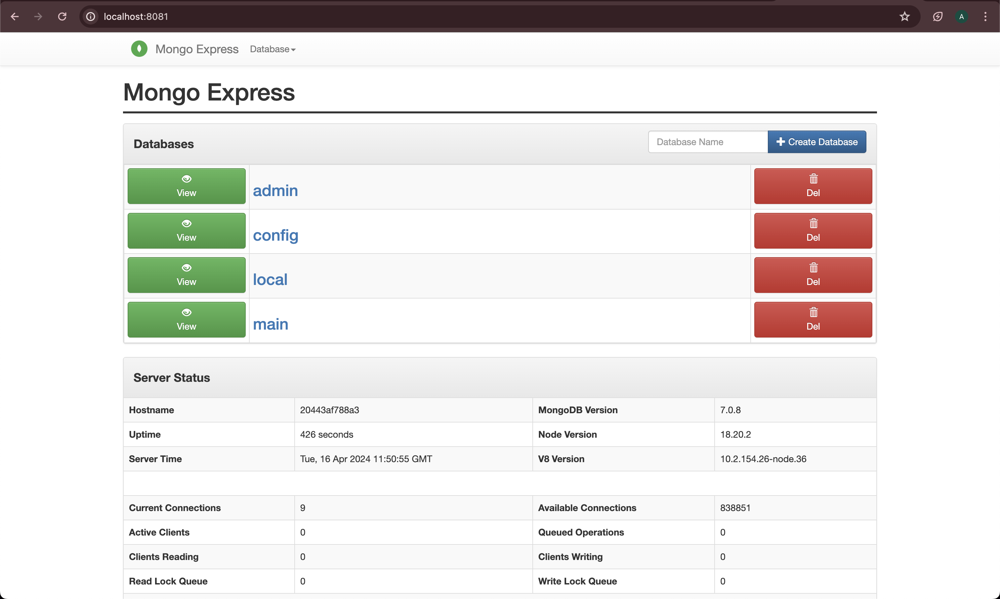

# recipes.ai

This is a web application built with React for the client-side and Python for the server-side. The application is containerized using Docker for easy deployment and management.

The ML Model is deployed and accessed by ngrok api which changes frequently. The model is trained on a dataset of recipes and ingredients. The model predicts the ingredients based on the recipe provided.

## Prerequisites

Before running the application, make sure you have the following installed:

- Docker: [Install Docker](https://docs.docker.com/get-docker/)

## Getting Started

To run the application, follow the steps below based on your operating system:

### Windows

1. Open a command prompt or PowerShell window.

2. Navigate to the project directory:

3. Start the application using Docker Compose:

   ```
   docker-compose up
   ```

4. Wait for the containers to build and start. Once the process is complete, you can access the application in your web browser at [http://localhost:3000](http://localhost:3000).

### Linux

1. Open a terminal.

2. Navigate to the project directory:

3. Start the application using Docker Compose:

   ```
   docker compose up
   ```


4. Wait for the containers to build and start. Once the process is complete, you can access the application in your web browser at [http://localhost:3000](http://localhost:3000).


### To Access the Database

1. Open [http://localhost:8081](http://localhost:8081) and wait for 2 mins.

2. Open [http://localhost:8081](http://localhost:8081) again and enter the following details:
   - Username: admin
   - Password: pass
3. Your database interface at the port `8081` would look as follows:


### Backend API

The backend API is accessible at [http://localhost:4000](http://localhost:4000).

**There are two endpoints:**

- GET /api/chat/list
- POST /api/chat/create
  body: { "ingredients": [] }
