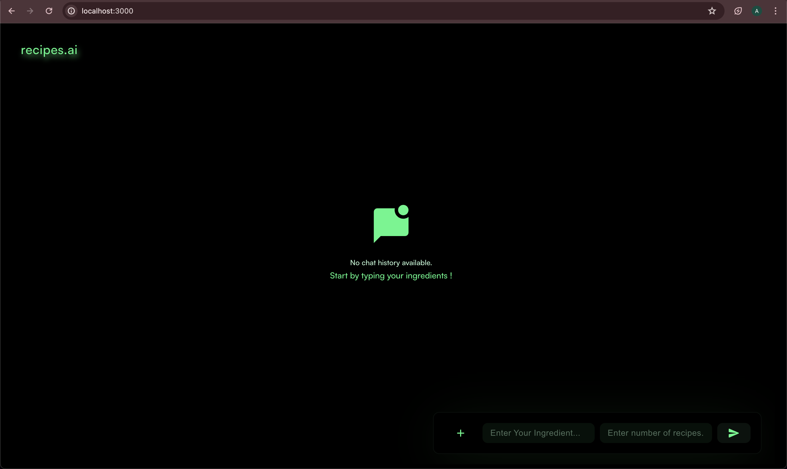
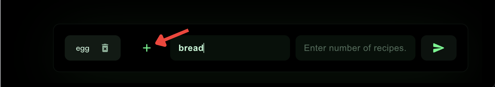
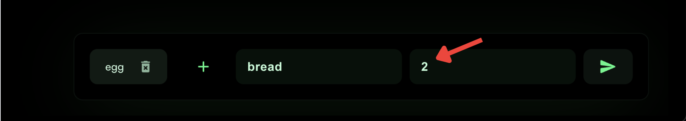
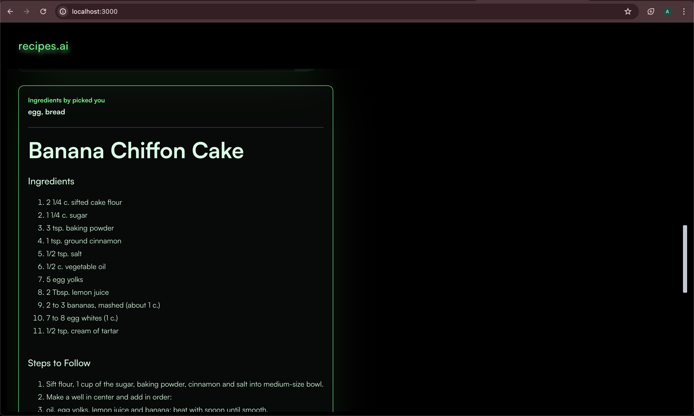
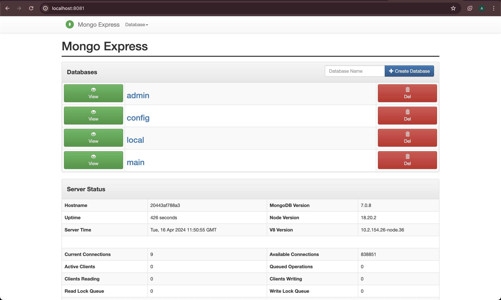
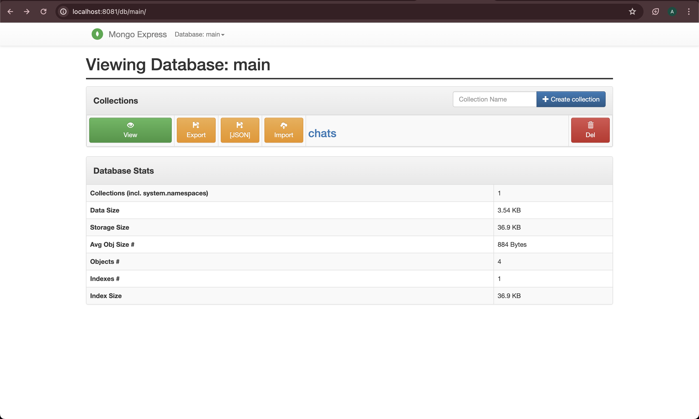
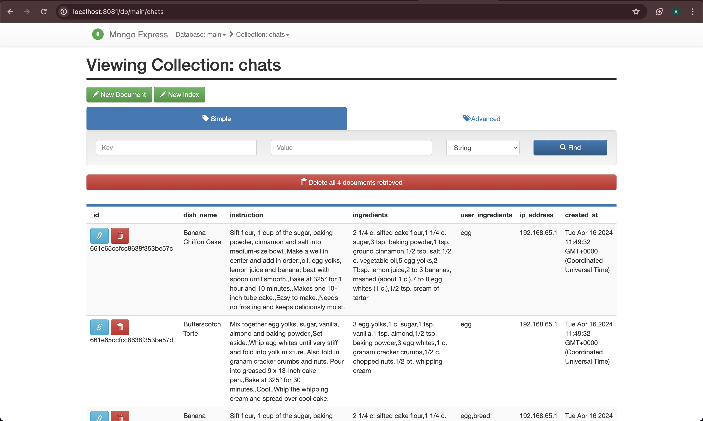

# Recipe Recommendation Application

This README file provides instructions on how to use the Recipe Recommendation application.

## Getting Started

1. Open your web browser and navigate to `localhost:3000` to access the application.

## User Interface

Upon opening the application, you will see the main interface as shown in the image below:

The interface consists of an input field where you can enter ingredients and a button to generate recipes.

## Adding Ingredients

To add ingredients for recipe generation, follow these steps:

1. On the bottom right side of the interface, you will find an input field labeled "Enter Your Ingredient:".

2. Type the name of an ingredient in the input field.

3. Press the addition button `("+")` next to the input field to add the ingredient to the list.

4. Repeat steps 2-3 to add more ingredients as desired.

## Specifying the Number of Recipes

Below the ingredient input field, you will find another input field labeled "Enter number of recipes".

Enter the desired number of recipe recommendations you want to receive based on the provided ingredients.

## Generating Recipes

Once you have added the desired ingredients and specified the number of recipes, click the button to generate the recipe recommendations.

The application will process your request and present you with a list of recommended recipes based on the provided ingredients and the specified number of recipes.

The generated recipes will include the recipe name, ingredients, and step-by-step instructions to follow.

## Accessing the Database

To access the database and view the tables, follow these steps:

1. Open your web browser and navigate to `localhost:8081`.

2. You will be presented with the database interface.

3. On the left, you will see a list of available databases. Click on the `main` database that corresponds to the searched recepies in the application.

4. Once you select the database, you can click on the view button to see the `chat` table entries.

5. Click on a table name to view its contents, such as the stored recipes, ingredients, or user information.

You can explore the different tables and their data to gain insights into the application's database structure and stored information.

## Conclusion

That's it! You now know how to use the Recipe Recommendation application. Feel free to explore different combinations of ingredients and generate a variety of recipe recommendations tailored to your preferences.

If you have any further questions or need assistance, please don't hesitate to reach out.

Happy cooking!